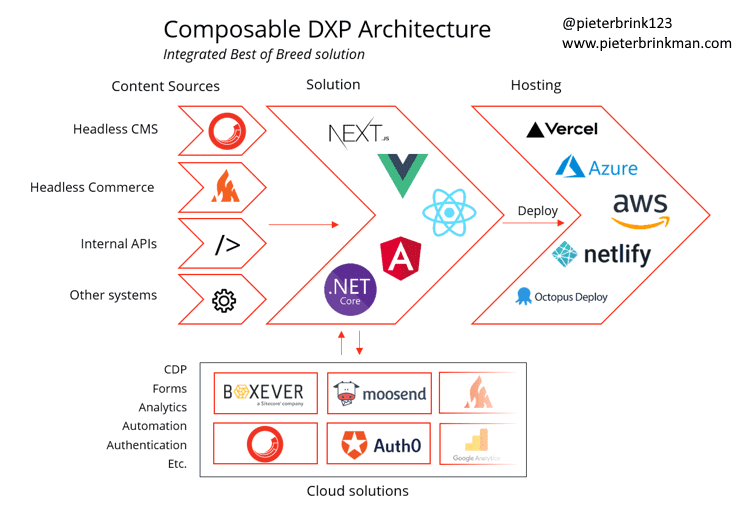

# MACH Alliance

**Keywords:** Market Standards

## Links

- [Main Website](https://machalliance.org)

## Videos

- [Discover Sitecore / What is MACH Architecture?](https://youtube.com/watch?v=lgRsAwxrw9Q)
- [Understand What MACH Architecture Is and Its Benefits](https://youtube.com/watch?v=Wk5Ln_WRKTE)

## Glossary

- Customer Data Platform (CDP)
- Digital Experience Platform (DXP)

## Termos

- Composable DXP

## What is MACH?

- M (Micro Services): Individual pieces of business functionality that are independently developed, deployed, and managed.
- A (API First): All functionality is exposed through an API.
- C (Cloud Native SaaS): SaaS that leverages the cloud, beyond storage and hosting, including elastic scaling and automatically updating.
- H (Headless): Front-end presentation is decoupled from back-end logic and channel, programming language, and is framework agnostic.

## Beneficts

- MACH architecture allows you to take advantage of the best technologies available in the market.
- MACH technologies support your composable needs.
- MACH architected applications are Cloud Native Software as a Service (SaaS) applications.

## Composable DXP Architecture

