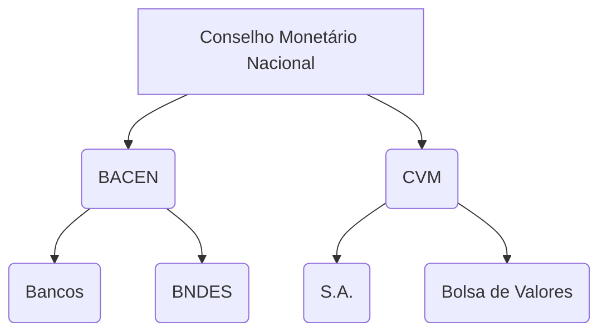

# Brazil

<!--
Réis
Cruzeiro
Cruzeiro Novo
Cruzado
Cruzado Novo
Real
-->

<!--
NYSE:ABEV
NYSE:BBD
NYSE:BSBR
NYSE:CIG
NYSE:EBR
NYSE:ERJ
NYSE:GGB
NYSE:GOL
NYSE:ITUB
NYSE:PBR
NYSE:VALE
NYSE:VIV
OTC:EGIEY
OTC:JBSAY
-->

<!--
QUANDL:BCB/11753

https://utilitarios.grupodpg.com.br/utilitarios/categoria/calculo-facil/775/custo-de-contratao-pj-x-clt-x-autnomo

https://bcb.gov.br/estabilidadefinanceira/sistema-valores-a-receber/

IAGRO

WIN1! / IND1! / IBV1!
DOL1! / WDO1!

RB1!*USDBRL/3.785411784

https://www.rankbr.com.br/tv

Kantar IBOPE Media
People Meter
-->

## Glossary

- Banco Central do Brasil (BACEN or BCB)
- Banco Nacional de Desenvolvimento Econômico e Social (BNDES)
- Comissão de Valores Mobiliários (CVM)
- Sociedade Anônima (S.A.)

## Terms

- Tripé Macroeconômico (Câmbio Flutuante, Metas de Inflação, Superávit Fiscal)

## Conselho Monetário Nacional

## Government

- [CNPJ](http://servicos.receita.fazenda.gov.br/Servicos/cnpjreva/Cnpjreva_Solicitacao.asp?cnpj=)
- [IRPF](/irpf.md)
- [PGMEI](http://www8.receita.fazenda.gov.br/SimplesNacional/Aplicacoes/ATSPO/pgmei.app/Identificacao)
- [Baixa da Empresa](https://gov.br/empresas-e-negocios/pt-br/empreendedor/servicos-para-mei/baixa-de-mei)
- [Detran-DF / Portal](https://portal.detran.df.gov.br/)
- [Taxa Selic](https://bcb.gov.br/controleinflacao/taxaselic)
- [Brazil Interest Rate](https://tradingeconomics.com/brazil/interest-rate)
- [TSE / Divulgação de Candidaturas e Contas Eleitorais](https://divulgacandcontas.tse.jus.br/divulga/#/)

## External Trade

- [Balança Comercial e Estatísticas de Comércio Exterior](https://www.gov.br/produtividade-e-comercio-exterior/pt-br/assuntos/comercio-exterior/estatisticas)
- [ComexVis](http://comexstat.mdic.gov.br/pt/comex-vis)
- [Secretaria de Comércio Exterior](https://www.gov.br/produtividade-e-comercio-exterior/pt-br/assuntos/comercio-exterior)

## Indicators

- [Brazil Government Budget](https://tradingeconomics.com/brazil/government-budget)

<!--
https://www.youtube.com/watch?v=8Kgo-PykDhk
https://www.youtube.com/watch?v=KOKS_apCwzA
https://www.youtube.com/watch?v=Nk1LG5Fi9Uk
-->

## Agencies

- Brazilian Institute of Geography and Statistics (BIGS) / Instituto Brasileiro de Geografia e Estatística (IBGE)

## Glossary

- iShares: Collection of ETFs managed by BlackRock
- Morgan Stanley Capital International (MSCI)
- World Equity Benchmark Shares (WEBS)

### Portuguese

- Certificado de Recebíveis Imobiliários (CRI)
- Fundos Imobiliários (FII)
- Índice Nacional de Preços ao Consumidor Amplo (IPCA)
- Instituto Brasileiro de Opinião Pública e Estatística (IBOPE)
- Preço de Paridade Internacional (PPI)
- Tribunal Superior Eleitoral (TSE)

## Terms

### Portuguese

- Diáspora Brasileira

## Exchange-Traded Fund (ETF)

- iShares MSCI Brazil `AMEX:EWZ`

## Exchanges

### Bovespa Index (IBOVESPA)

<!--
BMFBOVESPA:DI11!-(100-CME:GE1!)
ECONOMICS:BRIRYY-ECONOMICS:USIRYY
-->

#### Stock Codes

| Code | Type                | Example |
| ---- | ------------------- | ------- |
| 3    | Ordinary            | VALE3   |
| 4    | Preferred           | GGBR4   |
| 5    | Preferred Class A   | USIM5   |
| 6    | Preferred Class B   | ELET6   |
| 11   | BDRs, ETs and Units | BOVA11  |
