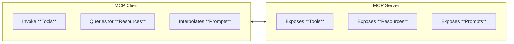

# Model Context Protocol (MCP)

<!--
https://smithery.ai
https://integrations.sh/
-->

**Keywords:** Function Calling Alternative

## Links

- [Code Repository](https://github.com/modelcontextprotocol/modelcontextprotocol)
- [Main Website](https://modelcontextprotocol.io)
- [Examples](https://modelcontextprotocol.io/examples)
- [Servers](https://github.com/modelcontextprotocol/servers)

<!--
https://github.com/modelcontextprotocol/quickstart-resources
-->

<!--
Tools

https://github.com/wong2/mcp-cli
MCP Package Registry: https://mcp-get.com
https://github.com/supercorp-ai/supergateway

https://zapier.com/mcp
-->

## Glossary

- You Only Look Once (YOLO)

## Transport Channels

- Standard Input/Output (stdio)
- Server-Sent Events (SSE)

## MCP Flow



### Tools

**Model-Controlled:**

Functions invoked by the model:

- Retrieve / Search
- Send Message
- Update DB

### Resources

**Application-Controlled:**

Data exposed to the application:

- Files
- DB Records
- API Responses

### Prompts

**User-Controlled:**

Pre-defined templates for AI interactions:

- Documentation Q&A
- Transcript Summary
- Output as JSON

## Tips

### Remove Authentication Files

```sh
rm -fR ~/.mcp-auth
```
