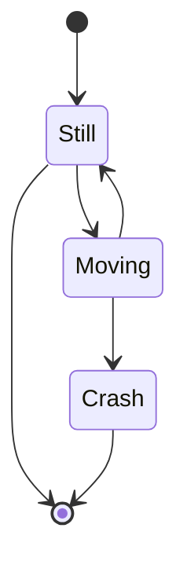

# mermaid

## Tools

- [Mermaid Live Editor](https://mermaid-js.github.io/mermaid-live-editor/)

## Using




## Tips

### Visual Studio Code

```sh
code \
  --install-extension bierner.markdown-mermaid \
  --install-extension bpruitt-goddard.mermaid-markdown-syntax-highlighting
```
