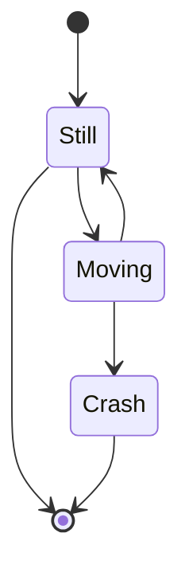

# mermaid

<!--
https://sequencediagram.org/
https://github.com/olaven/krets/blob/master/diagrams/database.md
-->

## Tools

- [Mermaid Live Editor](https://mermaid-js.github.io/mermaid-live-editor/)

## Posts

- [GitHub / Include diagrams in your Markdown files with Mermaid](https://github.blog/2022-02-14-include-diagrams-markdown-files-mermaid/)

## Using




## Tips

### Visual Studio Code

```sh
code \
  --install-extension bierner.markdown-mermaid \
  --install-extension bpruitt-goddard.mermaid-markdown-syntax-highlighting
```
