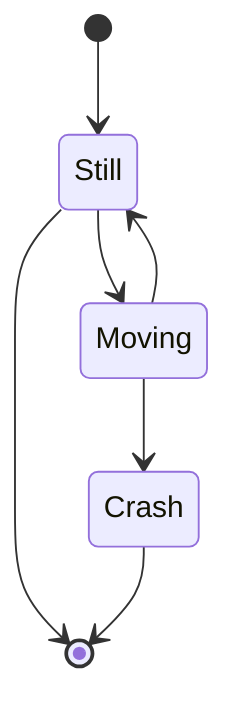

# Mermaid

<!--
4 spaces
-->

## Links

- [Main Website](https://mermaid.js.org/)
- [Live Editor](https://mermaid.live)

## Posts

- [GitHub / Include diagrams in your Markdown files with Mermaid](https://github.blog/2022-02-14-include-diagrams-markdown-files-mermaid/)

## Syntax

### Using




### Tips

#### Visual Studio Code

```sh
#
code --install-extension bierner.markdown-mermaid

#
jq '."recommendations" += ["bierner.markdown-mermaid"]' "$PWD"/.vscode/extensions.json | sponge "$PWD"/.vscode/extensions.json
```

<!--
code --install-extension bpruitt-goddard.mermaid-markdown-syntax-highlighting

jq '."recommendations" += ["bpruitt-goddard.mermaid-markdown-syntax-highlighting"]' "$PWD"/.vscode/extensions.json | sponge "$PWD"/.vscode/extensions.json
-->

## CLI

### Links

- [Code Repository](https://github.com/mermaid-js/mermaid-cli)

### Installation

#### Homebrew

```sh
brew install mermaid-cli
```

### Commands

```sh
mmdc -h
```

### Usage

```sh
#
mmdc \
  -t neutral \
  -i ./<filename>.mmd \
  -o ./<filename>.svg \
  -b white
```

### Tips

#### Using with Docs

**Refer:** `./package.json`

```json
{
  "scripts": {
    "docs:architecture": "mmdc -t neutral -i ./docs/architecture.mmd -o ./docs/assets/images/architecture.svg -b white"
  }
}
```
