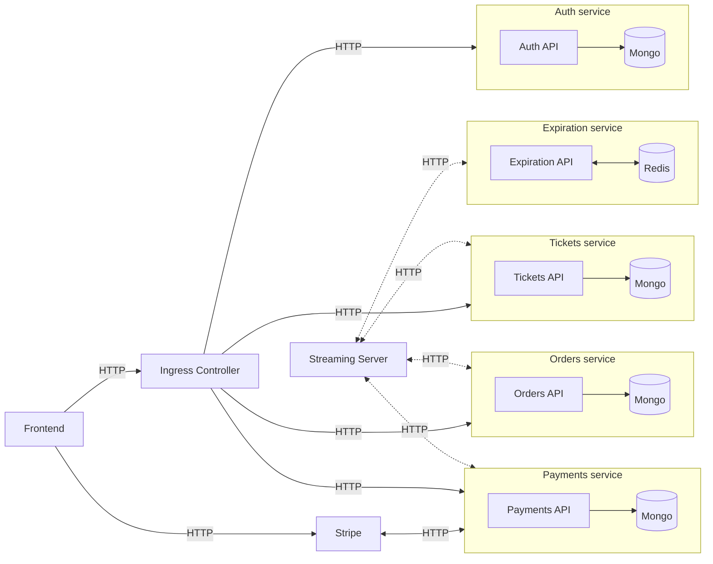

# Architecture

## Links

- [Syntax](https://mermaid.js.org/syntax/flowchart.html)

## Diagram

```mermaid
flowchart LR
%% defining styles
    classDef app fill:#f7e081,stroke:#333,stroke-width:1px

%% defining entities
    FE[Frontend]
    LB[Ingress Controller]
    A[Auth API]
    A-M[(Mongo)]
    T[Tickets API]
    T-M[(Mongo)]
    O[Orders API]
    O-M[(Mongo)]
    P[Payments API]
    P-M[(Mongo)]
    St[Stripe]
    E[Expiration API]
    E-R[(Redis)]
    SS[Streaming Server]

%% assigning styles to entities
    %%AS,OS,ES,TS,PS:::service
    %%class A,T,O,E,P,FE app;

%%click A "https://github.com/brunowego/boilerplates" _blank

%% flow
    FE -->|HTTP| LB
    FE -->|HTTP| St <-->|HTTP| PS
    LB --->|HTTP| AS & TS & OS & PS
    SS <-.->|HTTP| TS & OS & ES & PS
    subgraph AS [Auth service]
    direction LR
    A --> A-M
    end
    subgraph TS [Tickets service]
    direction LR
    T --> T-M
    end
    subgraph OS [Orders service]
    direction LR
    O --> O-M
    end
    subgraph ES [Expiration service]
    direction LR
    E <--> E-R
    end
    subgraph PS [Payments service]
    direction LR
    P --> P-M
    end
```

### Table of Contents

- Frontend: React App
- Ingress Controller: NGINX
- Streaming Server: NATS
