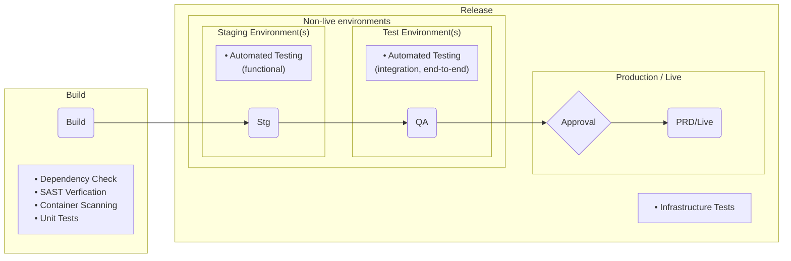

# Environment

## TBD

```mermaid
flowchart LR
    buildNode(Build)
    testEnv1Node(Stg)
    testEnvnNode(QA)
    approvalNode{Approval}
    prdNode(PRD/Live)
    infrastructureTestsNode[" #bull; Infrastructure Tests"]
    style infrastructureTestsNode align: left
    buildChecks[" #bull; Dependency Check\n #bull; SAST Verfication\n #bull; Container Scanning\n #bull; Unit Tests"]
    style buildChecks text-align:left;
    subgraph sgBuild[Build]
    direction LR
        buildNode
        buildChecks
    end

  subgraph sgRelease[Release]
    direction LR
    subgraph sgPreProd[Non-live environments\n\n]
        subgraph sgStg["Staging Environment(s)"]
            direction LR
            testEnv1Node
            subgraph sgStgChecks[" #bull; Automated Testing </br>(functional)"]
            end
        end
    subgraph sgQa["Test Environment(s)"]
        direction LR
        testEnvnNode
        subgraph sgQaChecks[" #bull; Automated Testing </br>(integration, end-to-end)"]
        end
    end
    end
    subgraph sgPrd[Production / Live]
        direction LR
        approvalNode
        prdNode
    end
    infrastructureTestsNode
  end
  buildNode --> testEnv1Node
  testEnv1Node --> testEnvnNode
  testEnvnNode --> approvalNode
  approvalNode --> prdNode
```
