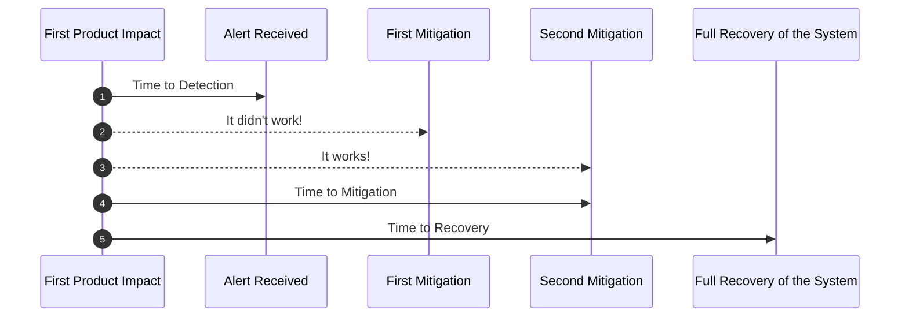

# Metrics

<!--
https://github.com/imjoseangel/sandbox/blob/devel/docs/sre-metrics.md
-->

## TBD

```mermaid
sequenceDiagram
    autonumber
    First Product Impact->>Alert Received: Time to Detection
    First Product Impact-->>First Mitigation: It didn't work!
    First Product Impact-->>Second Mitigation: It works!
    First Product Impact->>Second Mitigation: Time to Mitigation
    First Product Impact->>Full Recovery of the System: Time to Recovery
```
