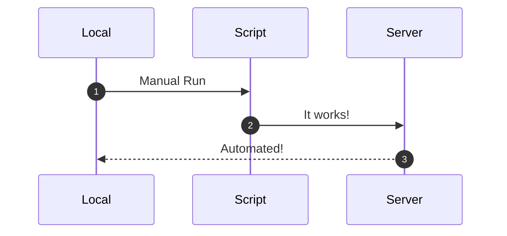
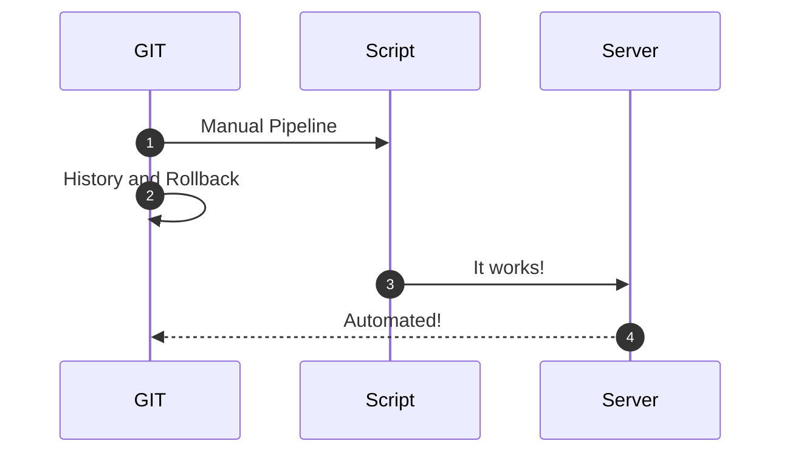
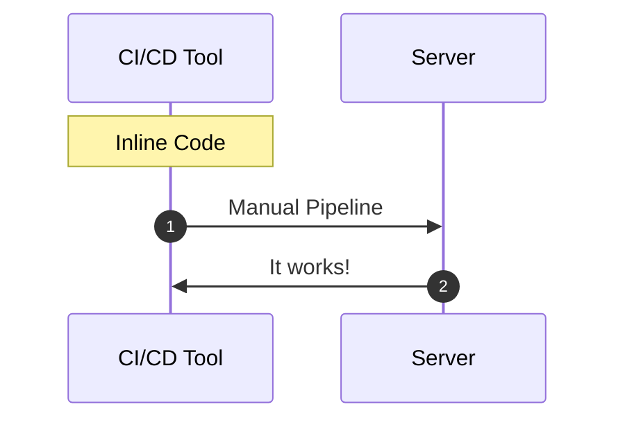
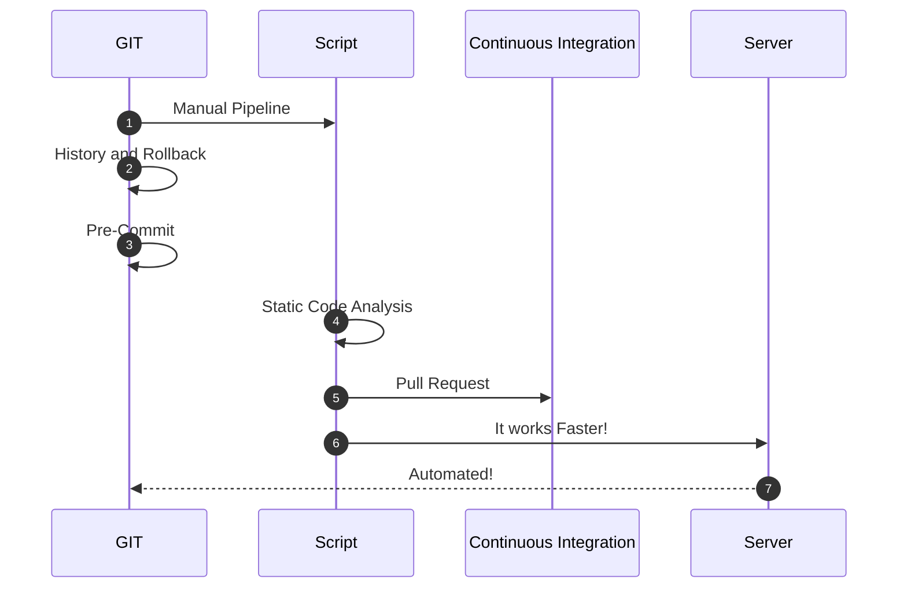
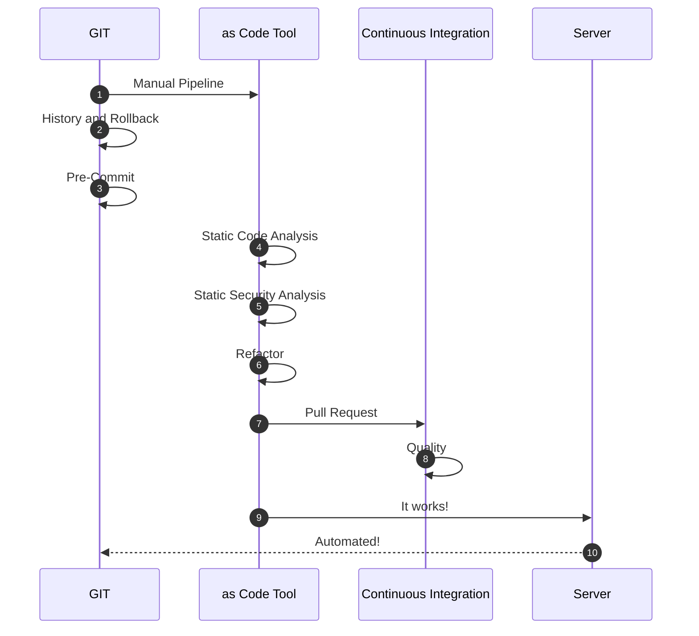
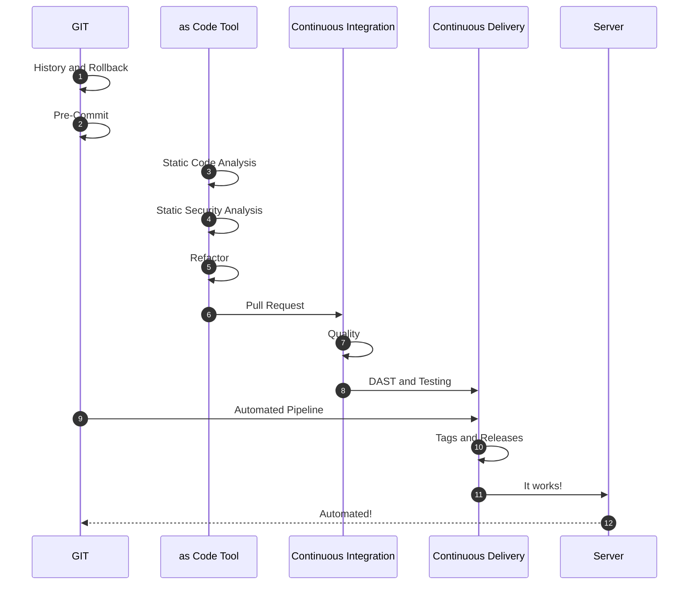
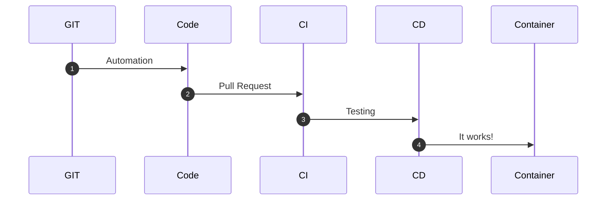

# Pipeline

<!--
https://github.com/imjoseangel/sandbox/blob/devel/docs/automation.md
-->

## TBD

```mermaid
sequenceDiagram
    autonumber
    Local->>Script: Manual Run
    Script->>Server: It works!
    Server-->>Local: Automated!
```

## TBD

```mermaid
sequenceDiagram
    autonumber
    GIT->>Script: Manual Pipeline
    GIT->>GIT: History and Rollback
    Script->>Server: It works!
    Server-->>GIT: Automated!
```

## TBD

```mermaid
sequenceDiagram
    autonumber
    Note over CI/CD Tool: Inline Code
    CI/CD Tool->>Server: Manual Pipeline
    Server->>CI/CD Tool: It works!
```

## TBD

```mermaid
sequenceDiagram
    autonumber
    GIT->>Script: Manual Pipeline
    GIT->>GIT: History and Rollback
    GIT->>GIT: Pre-Commit
    Script->>Script: Static Code Analysis
    Script->>Continuous Integration: Pull Request
    Script->>Server: It works Faster!
    Server-->>GIT: Automated!
```

## TBD

```mermaid
sequenceDiagram
    autonumber
    GIT->>as Code Tool: Manual Pipeline
    GIT->>GIT: History and Rollback
    GIT->>GIT: Pre-Commit
    as Code Tool->>as Code Tool: Static Code Analysis
    as Code Tool->>as Code Tool: Static Security Analysis
    as Code Tool->>as Code Tool: Refactor
    as Code Tool->>Continuous Integration: Pull Request
    Continuous Integration ->> Continuous Integration: Quality
    as Code Tool->>Server: It works!
    Server-->>GIT: Automated!
```

## TBD

```mermaid
sequenceDiagram
    autonumber
    GIT->>GIT: History and Rollback
    GIT->>GIT: Pre-Commit
    as Code Tool->>as Code Tool: Static Code Analysis
    as Code Tool->>as Code Tool: Static Security Analysis
    as Code Tool->>as Code Tool: Refactor
    as Code Tool->>Continuous Integration: Pull Request
    Continuous Integration ->> Continuous Integration: Quality
    Continuous Integration ->> Continuous Delivery: DAST and Testing
    GIT->>Continuous Delivery: Automated Pipeline
    Continuous Delivery ->> Continuous Delivery: Tags and Releases
    Continuous Delivery ->> Server: It works!
    Server-->>GIT: Automated!
```

## TBD

```mermaid
sequenceDiagram
    autonumber
    GIT->>Code: Automation
    Code ->>CI: Pull Request
    CI ->> CD: Testing
    CD ->> Container: It works!
```
