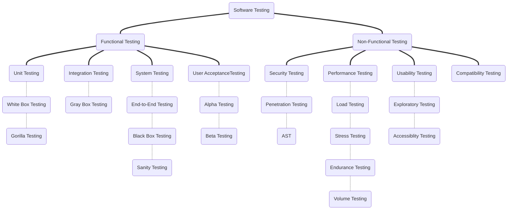

# Testing

## TBD

```mermaid
graph TD
    id0(Software Testing)===id11(Functional Testing)
    id0(Software Testing)===id12(Non-Functional Testing)

    id11(Functional Testing)===id21(Unit Testing)
    id11(Functional Testing)===id22(Integration Testing)
    id11(Functional Testing)===id23(System Testing)
    id11(Functional Testing)===id24(User Acceptance Testing)

    id12(Non-Functional Testing)===id25(Security Testing)
    id12(Non-Functional Testing)===id26(Performance Testing)
    id12(Non-Functional Testing)===id27(Usability Testing)
    id12(Non-Functional Testing)===id28(Compatibility Testing)

    id21(Unit Testing)
    -.-id301(White Box Testing)
    -.-id302(Gorilla Testing)

    id22(Integration Testing)
    -.-id303(Gray Box Testing)

    id23(System Testing)
    -.-id304(End-to-End Testing)
    -.-id305(Black Box Testing)
    -.-id306(Sanity Testing)

    id24(User AcceptanceTesting)
    -.-id307(Alpha Testing)
    -.-id308(Beta Testing)

    id25(Security Testing)
    -.-id309(Penetration Testing)
    -.-id310(AST)

    id26(Performance Testing)
    -.-id311(Load Testing)
    -.-id312(Stress Testing)
    -.-id313(Endurance Testing)
    -.-id314(Volume Testing)

    id27(Usability Testing)
    -.-id315(Exploratory Testing)
    -.-id316(Accessiblity Testing)

    id28(Compatibility Testing)
```
