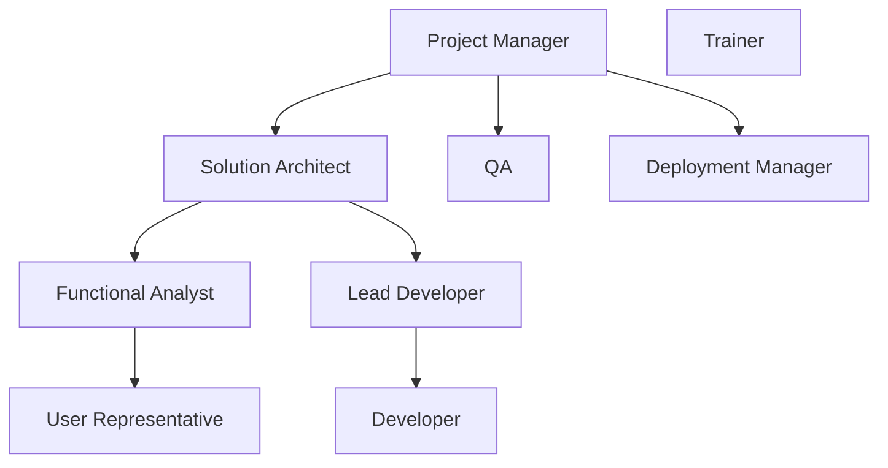

# Solution Architect in Software Development

## Principles

- Understand business problem
- Document non-technical business solution (functionalities)
- Convert solution to technical architecture (diagram)
- Convert architecture to code
- Manage developers
- Test code
- Deploy code

## Team Roles

### Legend

- **User Representative:** Person who knows the business problem
- **Functional Analyst:** Person who knows the business solution
- **Lead Developer:** Person who knows the technical solution
- **Developer:** Person who writes the code
- **QA:** Person who tests the code
- **Deployment Manager:** Person who deploys the code
- **Trainer:** Person who trains the users
- **Project Manager:** Person who manages the project
- **Solution Architect:** Person who converts business solution to technical solution

## Required Skills

- Understanding the Business
- Cross-Domain Understanding
- Multiple Perspectives
- People Skills (Communication)
- Lifelong Learning
