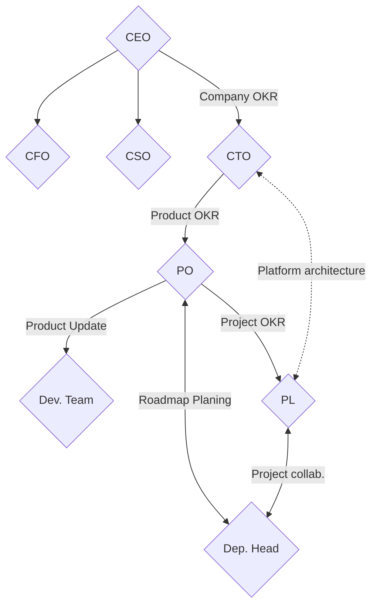
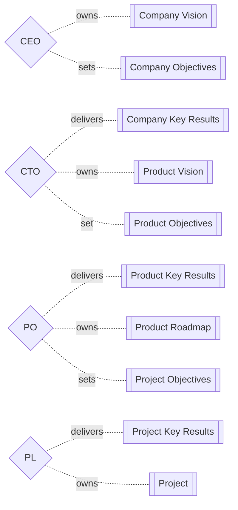

# Organizational Chart (a.k.a Organigram, Organogram, or Organizational Breakdown Structure)

## Glossary

- Chief Executive Officer (CEO)
- Chief Financial Officer (CFO)
- Chief Sales Officer (CSO)
- Chief Technology Officer (CTO)
- Objectives and Key Results (OKR)
- Product Owner (PO)
- Project Lead (PL)

<!--
- Business Manager (BM)
- Chief Analytics Officer (CAO)
- Chief Compliance Officer (CCO)
- Chief Customer Officer (CCO)
- Chief Data Officer (CDO)
- Chief Green Officer (CGO)
- Chief Human Resources Manager (CHRM)
- Chief Human Resources Officer (CHRO)
- Chief Information Officer (CIO)
- Chief Marketing Officer (CMO)
- Chief Operating Officer (COO)
- Chief Security Officer (CSO)
- Department of Human Resources (DHR)
- Enterprise Content Management (ECM)
- Product Manager (PM)
- Project Management Office (PMO)
-->

## Organigram

### Artifacts & Ownership

### Key Functions

| Position | Name |
| -------- | ---- |
| CEO      |      |
| CFO      |      |
| CSO      |      |
| CTO      |      |
| PO       |      |
| PL       |      |
